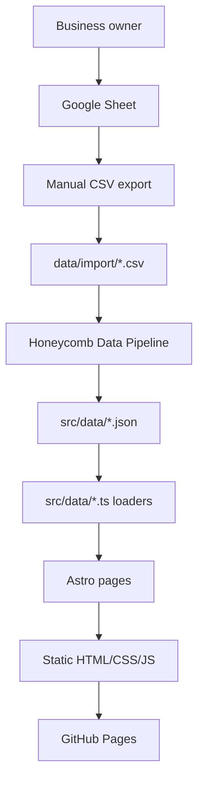
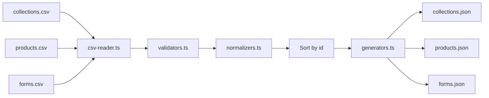
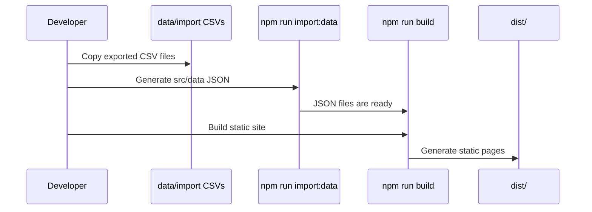
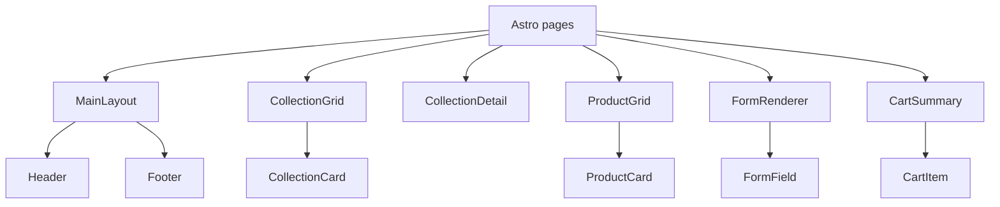

# Architecture

## Table Of Contents

- [Purpose](#purpose)
- [System Overview](#system-overview)
- [Project Structure](#project-structure)
- [Data Flow](#data-flow)
- [Build Pipeline](#build-pipeline)
- [Runtime Architecture](#runtime-architecture)
- [Data Loaders](#data-loaders)
- [Component Relationships](#component-relationships)
- [Design Principles](#design-principles)
- [Extension Points](#extension-points)
- [Related Documentation](#related-documentation)

## Purpose

Honeycomb Arts & Bakes is a static Astro website for a premium handmade bakery and sewing business. The architecture keeps business content in data files, renders collection and product pages from that data, and avoids any required backend so the site remains compatible with GitHub Pages.

The current source of truth is a manually exported Google Sheet. The website does not read Google Sheets directly. CSV exports are processed by the Honeycomb Data Pipeline into JSON files under `src/data/`.

## System Overview



The key design decision is separation between source import and website rendering. Astro only depends on generated JSON and typed loaders. Future source systems should replace only the input adapter, not the website.

## Project Structure

```text
data/import/              CSV exports and sample CSV files
docs/                     Maintainer documentation
scripts/pipeline/         Import pipeline stages
src/components/           Reusable Astro UI components
src/components/cart/      Cart-specific components
src/components/forms/     Dynamic form renderer components
src/components/products/  Product listing components
src/data/                 JSON data and loader modules
src/layouts/              Shared page layouts
src/pages/                Static and dynamic Astro routes
src/styles/               Global styles
src/types/                Shared TypeScript data contracts
src/utils/                Cart, order, path, and submission helpers
```

## Data Flow



Pipeline output is deterministic except for `_metadata.generatedAt`, which records the import timestamp. See [IMPORT_PIPELINE.md](./IMPORT_PIPELINE.md) for operational details and [GOOGLE_SHEET_SCHEMA.md](./GOOGLE_SHEET_SCHEMA.md) for the CSV schema.

## Build Pipeline

Local build workflow:



Commands:

- `npm run import:data`: converts CSV files into generated JSON.
- `npm run build`: builds the static Astro site.
- `npm run dev`: starts local Astro development.
- `npm run preview`: previews the built site.

## Runtime Architecture

At runtime the site is static. There is no server backend, database, paid service, or live Google Sheets dependency.

Astro generates:

- top-level pages such as `/`, `/bakery`, `/sewing`, `/cart`, and `/checkout`
- collection pages such as `/bakery/cakes`
- product pages such as `/bakery/cakes/birthday-cake`

Cart and checkout behavior is client-side. Submission currently uses an abstraction under `src/utils/submission/`, with `mockSubmissionProvider.ts` as the active no-backend provider.

## Data Loaders

The website imports JSON only through loader modules:

- `src/data/collections.ts`
- `src/data/products.ts`
- `src/data/forms.ts`

These loaders:

- read generated JSON from `json.data`
- still tolerate the previous root-array format
- map sheet-friendly values into UI-friendly types
- provide query helpers such as `getAllCollections`, `getProductsByCollection`, and `getFormById`

Keeping this mapping in loaders protects UI components from spreadsheet vocabulary and generated metadata.

## Component Relationships



Components should stay generic. Business-specific content belongs in data, not component branches such as `CakeForm` or `CookiePage`.

## Design Principles

- Preserve a handmade, warm, trustworthy, professional feeling.
- Prefer static-site compatibility and GitHub Pages deployment.
- Keep business content data-driven.
- Separate import, validation, normalization, generation, loading, and rendering.
- Use small reusable components and typed helpers.
- Avoid unnecessary frameworks, paid services, and backend dependencies.
- Treat future integrations as adapters around stable internal data contracts.

## Extension Points

Current architecture intentionally leaves room for:

- Google Sheets API input adapter
- image validation
- duplicate ID detection
- broken image detection
- pricing and availability
- tags and search indexes
- sitemap generation
- multilingual content
- real submission provider behind the existing submission abstraction

These should be added by extending the relevant layer, not by moving business logic into Astro pages.

## Related Documentation

- [DATA_MODEL.md](./DATA_MODEL.md): complete domain model and relationships
- [GOOGLE_SHEET_SCHEMA.md](./GOOGLE_SHEET_SCHEMA.md): worksheet columns and JSON mapping
- [IMPORT_PIPELINE.md](./IMPORT_PIPELINE.md): import process internals and commands
- [DEVELOPER_GUIDE.md](./DEVELOPER_GUIDE.md): local setup and common development tasks
