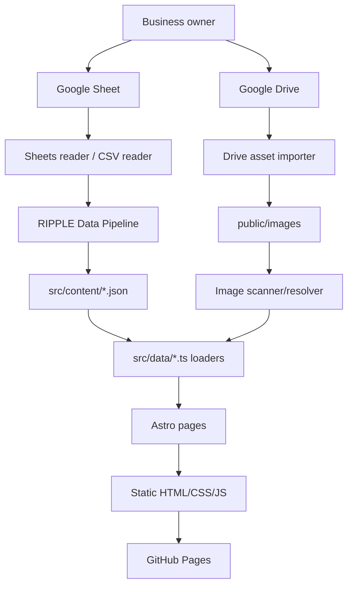
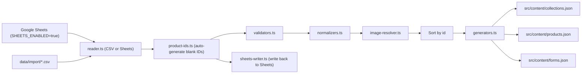
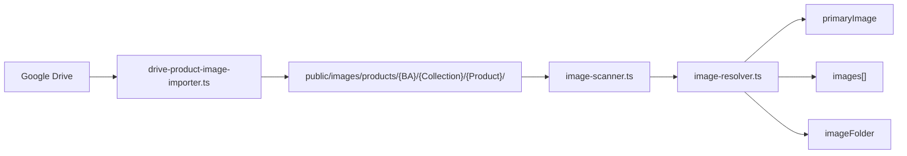
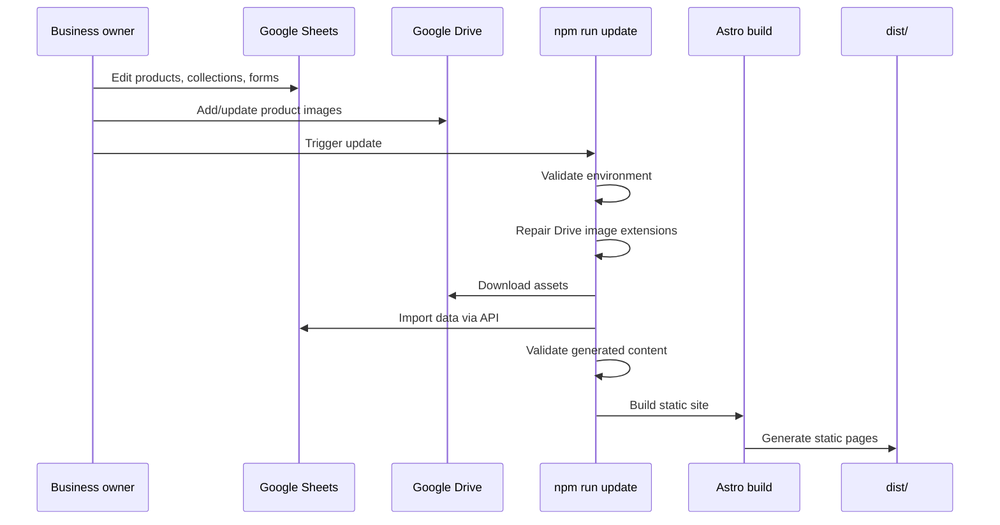
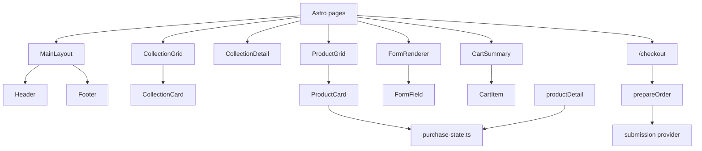

# Architecture

## Table Of Contents

- [Purpose](#purpose)
- [System Overview](#system-overview)
- [Project Structure](#project-structure)
- [Data Flow](#data-flow)
- [Build Pipeline](#build-pipeline)
- [Runtime Architecture](#runtime-architecture)
  - [Order Submission](#order-submission)
  - [Inquiry Submission](#inquiry-submission)
- [Data Loaders](#data-loaders)
- [Component Relationships](#component-relationships)
- [Design Principles](#design-principles)
- [Extension Points](#extension-points)
- [Related Documentation](#related-documentation)

## Purpose

RIPPLE Bakes & Makes is a static Astro website for a premium handmade bakery and sewing business. The architecture keeps business content in Google Sheets and images in Google Drive, processes them through a data pipeline into generated JSON, then renders collection and product pages from that data. There is no server backend.

## System Overview


```mermaid
flowchart TD
  owner["Business owner"] --> sheet["Google Sheet"]
  owner --> drive["Google Drive"]
  sheet --> reader["Sheets reader / CSV reader"]
  reader --> pipeline["RIPPLE Data Pipeline"]
  drive --> importer["Drive asset importer"]
  importer --> images["public/images"]
  images --> resolver["Image scanner/resolver"]
  pipeline --> json["src/content/*.json"]
  json --> loaders["src/data/*.ts loaders"]
  resolver --> loaders
  loaders --> pages["Astro pages"]
  pages --> static["Static HTML/CSS/JS"]
  static --> github["GitHub Pages"]
```

The pipeline supports two input modes:
- **Google Sheets API** (production, `SHEETS_ENABLED=true`) — reads worksheets directly
- **CSV files** (local development fallback) — reads from `data/import/*.csv`

The key design decision is separation between source import and website rendering. Astro only depends on generated JSON and typed loaders.

## Project Structure

```text
data/import/              CSV files (local fallback) and sample CSV files
docs/                     Maintainer documentation
scripts/pipeline/         Import pipeline, Drive sync, image scanning
src/components/           Reusable Astro UI components
src/components/cart/      Cart-specific components
src/components/forms/     Dynamic form renderer components
src/components/products/  Product listing components
src/content/              Generated JSON (collections.json, products.json, forms.json)
src/data/                 Typed loader modules (read generated JSON, expose query helpers)
src/data/static/          Static page data (gallery, testimonials)
src/layouts/              Shared page layouts
src/pages/                Static and dynamic Astro routes
src/styles/               Global styles
src/types/                Shared TypeScript data contracts
src/utils/                Cart, order, path, submission helpers, purchase state
public/images/            Product, collection, business-area, homepage, and gallery images
```

## Data Flow


```mermaid
flowchart LR
  reader["reader.ts (CSV or Sheets)"]
  sheets["Google Sheets (SHEETS_ENABLED=true)"] --> reader
  csv["data/import/*.csv"] --> reader
  reader --> ids["product-ids.ts (auto-generate blank IDs)"]
  ids --> validators["validators.ts"]
  validators --> normalizers["normalizers.ts"]
  normalizers --> resolver["image-resolver.ts"]
  resolver --> sort["Sort by id"]
  sort --> generators["generators.ts"]
  generators --> collectionsJson["src/content/collections.json"]
  generators --> productsJson["src/content/products.json"]
  generators --> formsJson["src/content/forms.json"]
  ids --> writer["sheets-writer.ts (write back to Sheets)"]
```

Product IDs with a blank `id` cell are auto-generated by `product-ids.ts` as `{BA}-{Collection Code}-{NNN}` (e.g. `BK-CA-001`). The collection code comes from the Collections sheet's `Collection Code` column, or is derived from an existing product ID in the same collection. In Sheets mode, `sheets-writer.ts` writes the generated IDs back to the Products worksheet so Google Sheets remains the single source of truth. Existing Product IDs are never modified or reused.

Product images are resolved separately via dynamic file-system scanning:


```mermaid
flowchart LR
  drive["Google Drive"] --> importer["drive-product-image-importer.ts"]
  importer --> productDirs["public/images/products/{BA}/{Collection}/{Product}/"]
  productDirs --> scanner["image-scanner.ts"]
  scanner --> resolver["image-resolver.ts"]
  resolver --> primaryImage["primaryImage"]
  resolver --> images["images[]"]
  resolver --> imageFolder["imageFolder"]
```

The image resolver uses a fallback hierarchy: product folder (`products/{BA}/{Collection}/{Product}/`) → collection folder (`collections/{BA}/{Collection}/`) → business-area folder (`business-areas/{BA}/`) → default placeholder warning. The resolver supports both the current multi-level hierarchy and legacy flat/code-based paths as fallbacks.

Pipeline output is deterministic except for `_metadata.generatedAt`, which records the import timestamp. See [IMPORT_PIPELINE.md](./IMPORT_PIPELINE.md) for operational details and [GOOGLE_SHEET_SCHEMA.md](./GOOGLE_SHEET_SCHEMA.md) for the sheet schema.

## Build Pipeline

Full update workflow:


```mermaid
sequenceDiagram
  participant Owner as Business owner
  participant Sheets as Google Sheets
  participant Drive as Google Drive
  participant Update as npm run update
  participant Astro as Astro build
  participant Dist as dist/

  Owner->>Sheets: Edit products, collections, forms
  Owner->>Drive: Add/update product images
  Owner->>Update: Trigger update
  Update->>Update: Validate environment
  Update->>Update: Repair Drive image extensions
  Update->>Drive: Download assets
  Update->>Sheets: Import data via API
  Update->>Update: Validate generated content
  Update->>Astro: Build static site
  Astro->>Dist: Generate static pages
```

Commands:

- `npm run update`: full pipeline — validate, sync Drive assets, import sheets data, validate content, build site.
- `npm run import:data`: data-only import (Google Sheets or CSV), generates JSON to `src/content/`.
- `npm run import:assets`: Drive asset sync only.
- `npm run build`: builds the static Astro site from current generated JSON.
- `npm run dev`: starts local Astro development.
- `npm run preview`: previews the built site.

## Runtime Architecture

At runtime the site is static. There is no server backend, database, paid service, or live Google Sheets dependency.

Astro generates:

- top-level pages such as `/`, `/bakery`, `/sewing`, `/cart`, and `/checkout`
- collection pages such as `/bakery/cakes`
- product pages such as `/bakery/cakes/birthday-cake`

Cart and checkout behavior is client-side (localStorage). The contact form is also client-side and submits inquiries through the same backend.

Both submission types use a provider abstraction under `src/utils/submission/` and share a single endpoint:

### Order Submission

```
Checkout page
    ↓
appsScriptSubmissionProvider (fetch POST)
    ↓
PUBLIC_SUBMISSION_ENDPOINT
    ↓
Google Apps Script Web App (doPost)
    ↓
handleOrder()
    ├── Orders sheet
    ├── Order Items sheet
    └── Email notification to owner
```

### Inquiry Submission

```
Contact Form (ContactForm.astro)
    ↓
Client-side fetch POST
    ↓
PUBLIC_SUBMISSION_ENDPOINT
    ↓
Google Apps Script Web App (doPost)
    ↓
handleInquiry()
    ├── Inquiries sheet
    └── Email notification to owner
```

## Doctor Health Monitoring System

The Doctor is a separate operational tool that evaluates website technical health and business catalog completeness on demand. It is independent of the build pipeline and website runtime.

### Architecture

```
npm run doctor
    ↓
scripts/doctor/doctor.ts (entry point)
    ├── Website health checks (19 checks, 100/100)
    ├── Business health analysis (catalog scoring)
    ├── Google visibility data (Search Console API)
    ├── Google visitor data (GA4 Data API)
    ├── Doctor Config sheet reader (enable/disable, recipients)
    └── Report generation
         ├── Console reporter (stdout)
         ├── Markdown report (scripts/doctor/reports/doctor-report.md)
         ├── JSON report (scripts/doctor/reports/doctor-report.json)
         ├── Owner JSON report (scripts/doctor/reports/doctor-report-owner.json)
         └── Email reporter (HTML via Apps Script)
              └── PUBLIC_SUBMISSION_ENDPOINT
                   └── Apps Script handleDoctorReport()
                        ├── Doctor Config sheet (enable/disable, recipients)
                        └── Email notification with htmlBody
```

### Key design decisions

- **Read-only by design.** Doctor reports only — no automatic repairs.
- **Two independent scoring systems.** Website Health (technical checks, 100/100) and Business Health (catalog completeness, 32/100). Each has its own score, status, and recommendations.
- **External analytics are informational, not health blockers.** Google Search Console and GA4 data are fetched during report generation but never affect health scores. Missing or unavailable external data displays as "Unavailable" without degrading any health status.
- **Same authentication pattern for all Google APIs.** Visibility and visitor services reuse the existing Google service account credentials — no additional setup required beyond configuring the environment variables already in use.
- **Separate Google Sheets for inventory vs. operations.** `INVENTORY_GOOGLE_SHEETS_ID` for products/collections/forms; `ORDERS_GOOGLE_SHEETS_ID` for orders, inquiries, and Doctor Config.
- **Doctor Config sheet controls delivery.** Enable/disable and recipient emails managed in the Orders spreadsheet — no code changes needed.
- **HTML email via Apps Script MailApp.** The reporter sends both `body` (plain text fallback) and `htmlBody` (full HTML with inline CSS). Apps Script uses `htmlBody` parameter for HTML rendering.
- **Generated reports are cached JSON.** Owner report (`doctor-report-owner.json`) is read by both the dashboard (at build time) and the email reporter (at doctor runtime).

### Email structure

```
600px centered table
├── Header (branded, date)
├── Overall Health (Website Health + Business Health score cards)
├── Top Priorities (action cards with severity colors)
├── Business Snapshot (6 metrics in 3-column grid)
│   ├── Total Products
│   ├── Collections
│   ├── Avg Images / Product
│   ├── Featured Products
│   ├── Homepage Featured
│   └── Gallery Featured
├── Progress (progress bars with counts)
│   ├── Active Products (count: 18/18)
│   ├── Descriptions (percentage)
│   └── Images ≥2 (percentage)
├── Product Inventory (3-column card grid)
│   ├── Needs Attention (⚠ cards with issue labels)
│   └── Complete (✓ cards)
├── Visibility (4 KPI cards: Impressions, Search Clicks, Avg Position, Indexed Pages)
├── Visitors (3 KPI cards + full-width Top Page card)
└── Footer (dashboard link, generation timestamp)
```

### Commands

- `npm run doctor`: runs all checks and generates all reports (including email if configured)
- `npm run build`: builds the dashboard page from cached owner report (no live Doctor run)

### Related files

- `scripts/doctor/doctor.ts` — entry point
- `scripts/doctor/business.ts` — business health scoring
- `scripts/doctor/doctor-config.reader.ts` — Doctor Config sheet reader
- `scripts/doctor/services/visibility.service.ts` — Google Search Console data fetcher
- `scripts/doctor/services/visitors.service.ts` — Google Analytics 4 data fetcher
- `scripts/doctor/reporters/email.reporter.ts` — HTML email generation + Apps Script delivery
- `scripts/doctor/reports/doctor-report-owner.json` — report consumed by dashboard and email
- `src/pages/doctor.astro` — dashboard page (reads owner report at build time)

**Provider selection:** `PUBLIC_SUBMISSION_ENDPOINT` is shared by both flows. When set, the Apps Script provider is active and handles both orders and inquiries. Without it, the mock provider handles submissions locally (no data written to Sheets).

Products without a numeric price display as **Coming Soon** and cannot be added to the cart. Products with `price: 0` are purchasable. Products with an inactive status (e.g. `Not Active`) stay visible but display as Coming Soon and cannot be ordered. Products hidden from all listings are controlled only by the `active` flag.

### Product State Flow

A product's state flows from the spreadsheet source through the pipeline into the customer UI:

```text
Google Sheets
      ↓
Pipeline normalization
      ↓
products.json
      ↓
Product model
      ↓
Purchase state
      ↓
Customer UI
```

Field responsibilities along this flow:

- **`active`** controls visibility. It decides whether the product is published on customer-facing pages at all.
- **`status`** controls ordering state. It decides whether the product can be ordered (`Active`) or is visible but not orderable (`Not Active`, shown as Coming Soon).
- **`availability`** controls customer-facing messaging. It communicates fulfillment expectations (e.g. Made to Order, In Stock, Seasonal, Coming Soon) and never affects ordering.

### Gallery Storytelling & Product Linking

The gallery connects creations with their products while keeping technical identifiers hidden from the owner.

```text
Owner selects Product Name (in Sheets)
      ↓
System resolves Product Name → Product ID
      ↓
Product page link
      ↓
Product description (story)
```

How it works:

- The owner manages business concepts — **Product Name**, **Collection**, **Category** — in Google Sheets. Product IDs, asset references, and file mappings stay internal.
- `galleryFeatured` decides which products appear in the gallery (defaults to `true`; set `FALSE` to exclude).
- `src/utils/gallery.ts` assembles `GalleryItem` records at build time. Product items resolve to their product page via `getProductPath`, collection items to their collection page, and personal items carry no link.
- Story copy is **never duplicated**. `galleryStory` reuses existing product copy with the priority **Product Description → Short Description → Product Name**.
- Cards render the image with no overlay text; Product Name, story, and a View Product / View Collection link sit below the image. The lightbox shows the larger image plus the same title, story, and link beneath it.

## Data Loaders

The website imports JSON only through loader modules:

- `src/data/collections.ts`
- `src/data/products.ts`
- `src/data/forms.ts`

These loaders:

- read generated JSON from `src/content/*.json`
- tolerate both the wrapper format (`{ data: [...] }`) and root-array format
- map sheet-friendly values into UI-friendly types
- provide query helpers such as `getAllCollections`, `getProductsByCollection`, `getFeaturedProducts`, `getHomepageFeatured`, and `getFormById`

Keeping this mapping in loaders protects UI components from spreadsheet vocabulary and generated metadata.

## Component Relationships


```mermaid
flowchart TD
  layout["MainLayout"] --> header["Header"]
  layout --> footer["Footer"]
  pages["Astro pages"] --> layout
  pages --> collectionGrid["CollectionGrid"]
  collectionGrid --> collectionCard["CollectionCard"]
  pages --> collectionDetail["CollectionDetail"]
  pages --> productGrid["ProductGrid"]
  productGrid --> productCard["ProductCard"]
  pages --> formRenderer["FormRenderer"]
  formRenderer --> formField["FormField"]
  pages --> cartSummary["CartSummary"]
  cartSummary --> cartItem["CartItem"]
  pages --> checkoutPage["/checkout"]
  checkoutPage --> orderPrep["prepareOrder"]
  orderPrep --> submission["submission provider"]
  productCard --> purchaseState["purchase-state.ts"]
  productDetail --> purchaseState
```

Components should stay generic. Business-specific content belongs in data, not component branches such as `CakeForm` or `CookiePage`.

## Design Principles

- Preserve a handmade, warm, trustworthy, professional feeling.
- Prefer static-site compatibility and GitHub Pages deployment.
- Keep business content data-driven.
- Separate import, validation, normalization, generation, loading, and rendering.
- Use small reusable components and typed helpers.
- Avoid unnecessary frameworks, paid services, and backend dependencies.
- Treat future integrations as adapters around stable internal data contracts.

## Extension Points

The architecture leaves room for future additions at each layer:

- image validation and optimization
- duplicate ID detection
- broken image detection
- tags and search indexes
- sitemap generation
- multilingual content
- richer pricing models (option-based pricing, quantity discounts)

These should extend the relevant layer, not move business logic into Astro pages.

## Testing Architecture

RIPPLE uses **Node.js built-in test runner** (`node:test` + `node:assert`) for lightweight, dependency-free testing.

### Structure

```
tests/
  fixtures/              CSV / JSON test data files
  business/              Business logic tests (src/utils/*, src/data/*)
  pipeline/              Pipeline stage tests (scripts/pipeline/*)
  doctor/                Doctor framework tests (scripts/doctor/*)
```

### Principles

- Test behavior, not implementation
- No mock libraries — use dependency injection patterns already in the codebase
- Fixtures are small, versioned, and never contain real customer data
- Tests never write to `src/content/`, call Google APIs, or require `.env` configuration

### Related Documentation

- [TESTING.md](./TESTING.md): complete testing philosophy, plan, and milestones
- [DATA_MODEL.md](./DATA_MODEL.md): complete domain model and relationships
- [GOOGLE_SHEET_SCHEMA.md](./GOOGLE_SHEET_SCHEMA.md): worksheet columns and JSON mapping
- [IMPORT_PIPELINE.md](./IMPORT_PIPELINE.md): import process internals and commands
- [BUSINESS_WORKFLOW.md](./BUSINESS_WORKFLOW.md): owner update instructions
- [ORDER_WORKFLOW.md](./ORDER_WORKFLOW.md): order and inquiry submission flows
