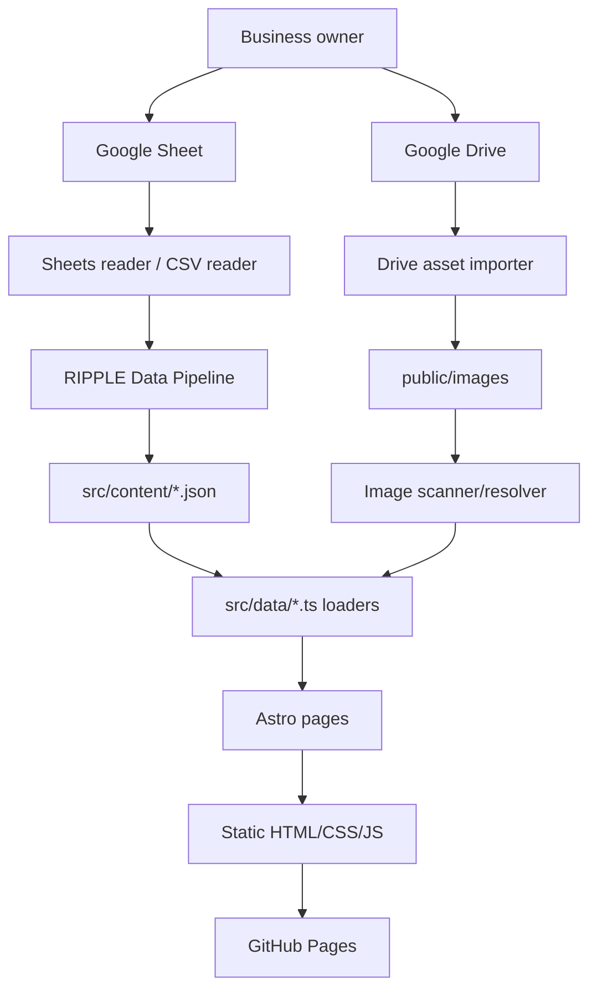
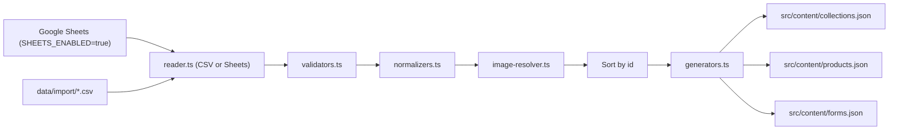
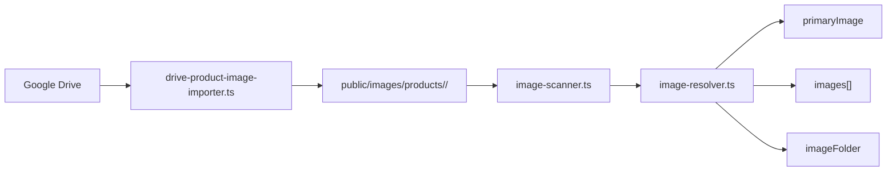
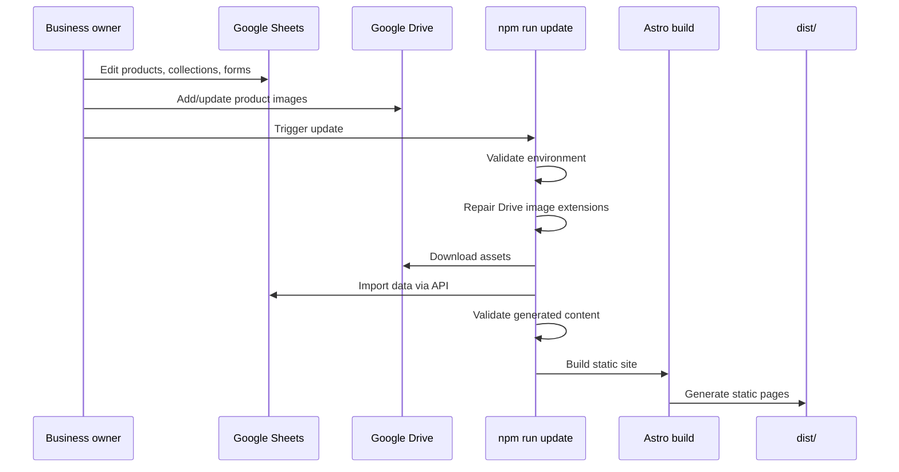
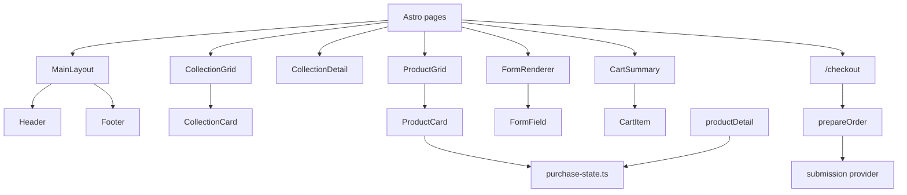

# Architecture

## Table Of Contents

- [Purpose](#purpose)
- [System Overview](#system-overview)
- [Project Structure](#project-structure)
- [Data Flow](#data-flow)
- [Build Pipeline](#build-pipeline)
- [Runtime Architecture](#runtime-architecture)
  - [Order Submission](#order-submission)
  - [Inquiry Submission](#inquiry-submission)
- [Data Loaders](#data-loaders)
- [Component Relationships](#component-relationships)
- [Design Principles](#design-principles)
- [Extension Points](#extension-points)
- [Related Documentation](#related-documentation)

## Purpose

RIPPLE Bakes & Makes is a static Astro website for a premium handmade bakery and sewing business. The architecture keeps business content in Google Sheets and images in Google Drive, processes them through a data pipeline into generated JSON, then renders collection and product pages from that data. There is no server backend.

## System Overview


```mermaid
flowchart TD
  owner["Business owner"] --> sheet["Google Sheet"]
  owner --> drive["Google Drive"]
  sheet --> reader["Sheets reader / CSV reader"]
  reader --> pipeline["RIPPLE Data Pipeline"]
  drive --> importer["Drive asset importer"]
  importer --> images["public/images"]
  images --> resolver["Image scanner/resolver"]
  pipeline --> json["src/content/*.json"]
  json --> loaders["src/data/*.ts loaders"]
  resolver --> loaders
  loaders --> pages["Astro pages"]
  pages --> static["Static HTML/CSS/JS"]
  static --> github["GitHub Pages"]
```

The pipeline supports two input modes:
- **Google Sheets API** (production, `SHEETS_ENABLED=true`) — reads worksheets directly
- **CSV files** (local development fallback) — reads from `data/import/*.csv`

The key design decision is separation between source import and website rendering. Astro only depends on generated JSON and typed loaders.

## Project Structure

```text
data/import/              CSV files (local fallback) and sample CSV files
docs/                     Maintainer documentation
scripts/pipeline/         Import pipeline, Drive sync, image scanning
src/components/           Reusable Astro UI components
src/components/cart/      Cart-specific components
src/components/forms/     Dynamic form renderer components
src/components/products/  Product listing components
src/content/              Generated JSON (collections.json, products.json, forms.json)
src/data/                 Typed loader modules (read generated JSON, expose query helpers)
src/data/static/          Static page data (gallery, testimonials)
src/layouts/              Shared page layouts
src/pages/                Static and dynamic Astro routes
src/styles/               Global styles
src/types/                Shared TypeScript data contracts
src/utils/                Cart, order, path, submission helpers, purchase state
public/images/            Product, collection, business-area, and homepage images
```

## Data Flow


```mermaid
flowchart LR
  reader["reader.ts (CSV or Sheets)"]
  sheets["Google Sheets (SHEETS_ENABLED=true)"] --> reader
  csv["data/import/*.csv"] --> reader
  reader --> validators["validators.ts"]
  validators --> normalizers["normalizers.ts"]
  normalizers --> resolver["image-resolver.ts"]
  resolver --> sort["Sort by id"]
  sort --> generators["generators.ts"]
  generators --> collectionsJson["src/content/collections.json"]
  generators --> productsJson["src/content/products.json"]
  generators --> formsJson["src/content/forms.json"]
```

Product images are resolved separately via dynamic file-system scanning:


```mermaid
flowchart LR
  drive["Google Drive"] --> importer["drive-product-image-importer.ts"]
  importer --> productDirs["public/images/products/<ProductID>/"]
  productDirs --> scanner["image-scanner.ts"]
  scanner --> resolver["image-resolver.ts"]
  resolver --> primaryImage["primaryImage"]
  resolver --> images["images[]"]
  resolver --> imageFolder["imageFolder"]
```

The image resolver uses a fallback hierarchy: product folder → collection folder → business-area folder → default placeholder warning.

Pipeline output is deterministic except for `_metadata.generatedAt`, which records the import timestamp. See [IMPORT_PIPELINE.md](./IMPORT_PIPELINE.md) for operational details and [GOOGLE_SHEET_SCHEMA.md](./GOOGLE_SHEET_SCHEMA.md) for the sheet schema.

## Build Pipeline

Full update workflow:


```mermaid
sequenceDiagram
  participant Owner as Business owner
  participant Sheets as Google Sheets
  participant Drive as Google Drive
  participant Update as npm run update
  participant Astro as Astro build
  participant Dist as dist/

  Owner->>Sheets: Edit products, collections, forms
  Owner->>Drive: Add/update product images
  Owner->>Update: Trigger update
  Update->>Update: Validate environment
  Update->>Update: Repair Drive image extensions
  Update->>Drive: Download assets
  Update->>Sheets: Import data via API
  Update->>Update: Validate generated content
  Update->>Astro: Build static site
  Astro->>Dist: Generate static pages
```

Commands:

- `npm run update`: full pipeline — validate, sync Drive assets, import sheets data, validate content, build site.
- `npm run import:data`: data-only import (Google Sheets or CSV), generates JSON to `src/content/`.
- `npm run import:assets`: Drive asset sync only.
- `npm run build`: builds the static Astro site from current generated JSON.
- `npm run dev`: starts local Astro development.
- `npm run preview`: previews the built site.

## Runtime Architecture

At runtime the site is static. There is no server backend, database, paid service, or live Google Sheets dependency.

Astro generates:

- top-level pages such as `/`, `/bakery`, `/sewing`, `/cart`, and `/checkout`
- collection pages such as `/bakery/cakes`
- product pages such as `/bakery/cakes/birthday-cake`

Cart and checkout behavior is client-side (localStorage). The contact form is also client-side and submits inquiries through the same backend.

Both submission types use a provider abstraction under `src/utils/submission/` and share a single endpoint:

### Order Submission

```
Checkout page
    ↓
appsScriptSubmissionProvider (fetch POST)
    ↓
PUBLIC_SUBMISSION_ENDPOINT
    ↓
Google Apps Script Web App (doPost)
    ↓
handleOrder()
    ├── Orders sheet
    ├── Order Items sheet
    └── Email notification to owner
```

### Inquiry Submission

```
Contact Form (ContactForm.astro)
    ↓
Client-side fetch POST
    ↓
PUBLIC_SUBMISSION_ENDPOINT
    ↓
Google Apps Script Web App (doPost)
    ↓
handleInquiry()
    ├── Inquiries sheet
    └── Email notification to owner
```

**Provider selection:** `PUBLIC_SUBMISSION_ENDPOINT` is shared by both flows. When set, the Apps Script provider is active and handles both orders and inquiries. Without it, the mock provider handles submissions locally (no data written to Sheets).

Products without a numeric price display as **Coming Soon** and cannot be added to the cart. Products with `price: 0` are purchasable. Inactive products are hidden from listings.

## Data Loaders

The website imports JSON only through loader modules:

- `src/data/collections.ts`
- `src/data/products.ts`
- `src/data/forms.ts`

These loaders:

- read generated JSON from `src/content/*.json`
- tolerate both the wrapper format (`{ data: [...] }`) and root-array format
- map sheet-friendly values into UI-friendly types
- provide query helpers such as `getAllCollections`, `getProductsByCollection`, `getFeaturedProducts`, `getHomepageFeatured`, and `getFormById`

Keeping this mapping in loaders protects UI components from spreadsheet vocabulary and generated metadata.

## Component Relationships


```mermaid
flowchart TD
  layout["MainLayout"] --> header["Header"]
  layout --> footer["Footer"]
  pages["Astro pages"] --> layout
  pages --> collectionGrid["CollectionGrid"]
  collectionGrid --> collectionCard["CollectionCard"]
  pages --> collectionDetail["CollectionDetail"]
  pages --> productGrid["ProductGrid"]
  productGrid --> productCard["ProductCard"]
  pages --> formRenderer["FormRenderer"]
  formRenderer --> formField["FormField"]
  pages --> cartSummary["CartSummary"]
  cartSummary --> cartItem["CartItem"]
  pages --> checkoutPage["/checkout"]
  checkoutPage --> orderPrep["prepareOrder"]
  orderPrep --> submission["submission provider"]
  productCard --> purchaseState["purchase-state.ts"]
  productDetail --> purchaseState
```

Components should stay generic. Business-specific content belongs in data, not component branches such as `CakeForm` or `CookiePage`.

## Design Principles

- Preserve a handmade, warm, trustworthy, professional feeling.
- Prefer static-site compatibility and GitHub Pages deployment.
- Keep business content data-driven.
- Separate import, validation, normalization, generation, loading, and rendering.
- Use small reusable components and typed helpers.
- Avoid unnecessary frameworks, paid services, and backend dependencies.
- Treat future integrations as adapters around stable internal data contracts.

## Extension Points

The architecture leaves room for future additions at each layer:

- image validation and optimization
- duplicate ID detection
- broken image detection
- tags and search indexes
- sitemap generation
- multilingual content
- richer pricing models (option-based pricing, quantity discounts)

These should extend the relevant layer, not move business logic into Astro pages.

## Related Documentation

- [DATA_MODEL.md](./DATA_MODEL.md): complete domain model and relationships
- [GOOGLE_SHEET_SCHEMA.md](./GOOGLE_SHEET_SCHEMA.md): worksheet columns and JSON mapping
- [IMPORT_PIPELINE.md](./IMPORT_PIPELINE.md): import process internals and commands
- [BUSINESS_WORKFLOW.md](./BUSINESS_WORKFLOW.md): owner update instructions
- [ORDER_WORKFLOW.md](./ORDER_WORKFLOW.md): order and inquiry submission flows
