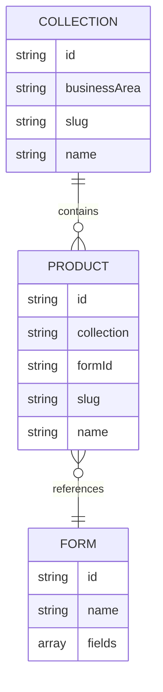
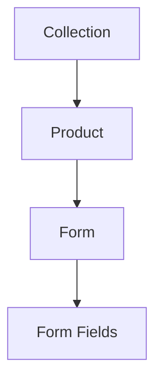

# Data Model

## Table Of Contents

- [Purpose](#purpose)
- [Generated Data Wrapper](#generated-data-wrapper)
- [Collections](#collections)
- [Products](#products)
- [Forms](#forms)
- [Relationships](#relationships)
- [Related Documentation](#related-documentation)

## Purpose

This document describes the domain data consumed by the Astro website. It focuses on the generated JSON records and the TypeScript types in `src/types/`. For spreadsheet column details, see [GOOGLE_SHEET_SCHEMA.md](./GOOGLE_SHEET_SCHEMA.md).

## Generated Data Wrapper

Generated JSON files use a shared wrapper:

```json
{
  "_metadata": {
    "generated": true,
    "generatedAt": "2026-07-22T18:59:25.378Z",
    "source": "Honeycomb Data Pipeline",
    "version": 1
  },
  "data": []
}
```

Loader modules read `data` and map records into runtime types.

## Collections

A collection groups related products and owns collection-level content.

Example IDs:

- `bakery-cakes`
- `sewing-custom-sewing`

Properties:

| Property | Type | Required | Example | Notes |
| --- | --- | --- | --- | --- |
| `id` | string | Yes | `bakery-cakes` | Stable unique identifier. |
| `category` | `bakery` or `sewing` | Loader-derived | `bakery` | Runtime category derived from `businessArea`. |
| `businessArea` | string | Yes in source | `bakery` | Sheet-friendly category alias. |
| `slug` | string | Yes for routing | `cakes` | Used in collection URLs. |
| `title` | string | Loader-derived | `Cakes` | UI title, defaults from `name`. |
| `name` | string | Yes in source | `Cakes` | Sheet-friendly label. |
| `subtitle` | string | Recommended | `Made for celebrations.` | Short display subtitle. |
| `shortDescription` | string | Recommended | `Thoughtful celebration cakes...` | Used in cards and summaries. |
| `description` | string | Recommended | `Celebration cakes should feel special...` | Longer detail copy. |
| `imageFolder` | string | Optional | `bakery/cakes` | Future image organization hint. |
| `heroImage` | string or null | Optional | `null` | Reserved for real collection imagery. |
| `galleryImages` | array | Loader-derived | `[{ "caption": "A soft finish" }]` | Built from `galleryCaptions`. |
| `galleryCaptions` | string array | Optional source | `["A soft finish"]` | Source field used to build gallery placeholders. |
| `popularIdeas` | string array | Optional | `["Birthday cake"]` | Display prompts on collection detail pages. |
| `customizationNote` | string | Optional | `Share your date...` | Guidance text for inquiries. |
| `featured` | boolean | Optional | `true` | Used for featured sections. |
| `active` | boolean | Loader-derived | `true` | Derived from `status`. |
| `status` | `Active` or `Inactive` | Optional | `Active` | Source visibility flag. |
| `displayOrder` | number | Recommended | `3` | Sort order within business area. |
| `imageTone` | `wheat`, `rose`, `cream`, `sage`, `cocoa` | Optional | `cream` | Placeholder visual treatment. |
| `badge` | string | Optional | `Seasonal` | Reserved display label. |

## Products

A product belongs to one collection and may reference one form.

Example IDs:

- `bakery-cakes-birthday-cake`
- `sewing-custom-sewing-adult-t-shirt`

Properties:

| Property | Type | Required | Example | Notes |
| --- | --- | --- | --- | --- |
| `id` | string | Yes | `bakery-cakes-birthday-cake` | Stable unique identifier. |
| `collectionId` | string | Loader-derived | `bakery-cakes` | Runtime parent collection ID. |
| `collection` | string | Yes in source | `bakery-cakes` | Sheet-friendly parent collection reference. |
| `category` | product category | Recommended | `cake` | Product type such as `cake`, `shirt`, or `bread`. |
| `businessArea` | `bakery` or `sewing` | Yes | `bakery` | Business division. |
| `slug` | string | Yes for routing | `birthday-cake` | Used in product URLs. |
| `title` | string | Loader-derived | `Birthday Cake` | UI title, defaults from `name`. |
| `name` | string | Yes in source | `Birthday Cake` | Sheet-friendly label. |
| `subtitle` | string | Recommended | `Classic layers made to celebrate.` | Product detail subtitle. |
| `shortDescription` | string | Recommended | `Customizable layer cake...` | Card summary. |
| `description` | string | Recommended | `Our signature birthday cake...` | Product detail copy. |
| `image` | string or null | Optional | `null` | Product image path when available. |
| `imageFolder` | string | Optional | `bakery/cakes/birthday-cake` | Future image organization hint. |
| `imageTone` | tone string | Optional | `cream` | Placeholder visual treatment. |
| `status` | product status | Optional | `available` | Loader maps source labels like `Active` to runtime values. |
| `active` | boolean | Optional | `true` | Controls public listing. |
| `featured` | boolean | Optional | `true` | Used for featured sections. |
| `displayOrder` | number | Recommended | `1` | Sort order within a group. |
| `formId` | string | Yes in source | `birthday-cake-form` | References a form definition. |
| `priceLabel` | string | Optional | `From $45` | Display-only pricing copy. |
| `customization` | object | Optional | `{}` | Reserved for richer product customization metadata. |

Products connect to:

- collections through `collection` in source data and `collectionId` at runtime
- forms through `formId`
- images through `image` or future assets organized under `imageFolder`

## Forms

A form describes configurable fields rendered by `FormRenderer`.

Properties:

| Property | Type | Required | Example | Notes |
| --- | --- | --- | --- | --- |
| `id` | string | Yes | `birthday-cake-form` | Stable identifier referenced by products. |
| `name` | string | Yes | `Birthday Cake` | Sheet-friendly label. |
| `title` | string | Loader-derived | `Birthday Cake` | UI title, defaults from `name`. |
| `description` | string | Optional | `Customize a birthday cake order.` | Short form summary. |
| `fields` | array | Recommended | `[{ "id": "flavor" }]` | Dynamic field definitions. |

### Field Structure

| Property | Type | Required | Example | Notes |
| --- | --- | --- | --- | --- |
| `id` | string | Yes | `flavor` | Field key stored in cart configuration. |
| `label` | string | Yes | `Flavor` | Display label. |
| `type` | string | Yes | `select` | Must be a supported field type. |
| `required` | boolean | Yes | `true` | Enables required validation. |
| `section` | string | Optional | `Cake Details` | Groups related fields. |
| `placeholder` | string | Optional | `Happy birthday, Maya!` | Input hint. |
| `helpText` | string | Optional | `Optional short message...` | Supporting text. |
| `defaultValue` | string | Optional | `vanilla` | Initial value. |
| `options` | array | For choice fields | `[{ "value": "vanilla", "label": "Vanilla" }]` | Used by select, radio, and multiselect fields. |
| `condition` | object | Optional | `{ "fieldId": "theme", "equals": "other" }` | Shows a field based on another field's value. |
| `validation` | object | Optional | `{ "maxLength": 60 }` | Browser validation hints. |

Supported field types:

- `text`
- `textarea`
- `select`
- `multiselect`
- `checkbox`
- `radio`
- `number`
- `date`
- `email`
- `phone`

Future field types may include file upload, image upload, color picker, and richer option pricing. These should extend `src/types/form.ts` and `FormField.astro`.

## Relationships





Collection and product relationships drive dynamic routes. Product and form relationships drive inquiry and cart configuration behavior.

## Related Documentation

- [ARCHITECTURE.md](./ARCHITECTURE.md): system architecture and runtime structure
- [GOOGLE_SHEET_SCHEMA.md](./GOOGLE_SHEET_SCHEMA.md): source worksheet columns
- [IMPORT_PIPELINE.md](./IMPORT_PIPELINE.md): generated JSON process
- [DEVELOPER_GUIDE.md](./DEVELOPER_GUIDE.md): common maintainer workflows
