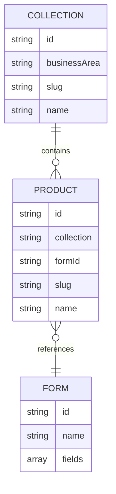
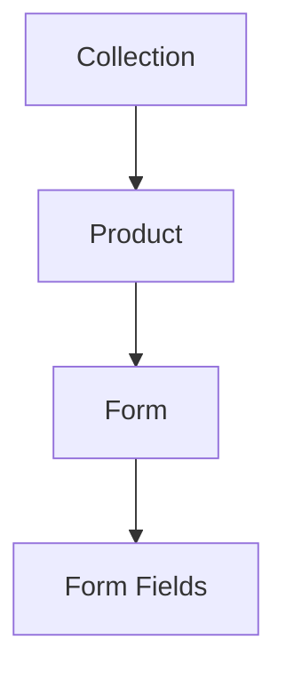

# Data Model

## Table Of Contents

- [Purpose](#purpose)
- [Generated Data Wrapper](#generated-data-wrapper)
- [Collections](#collections)
- [Products](#products)
- [Forms](#forms)
- [Relationships](#relationships)
- [Related Documentation](#related-documentation)

## Purpose

This document describes the domain data consumed by the Astro website. It focuses on the generated JSON records (stored in `src/content/`) and the TypeScript types in `src/types/`. For spreadsheet column details, see [GOOGLE_SHEET_SCHEMA.md](./GOOGLE_SHEET_SCHEMA.md).

## Generated Data Wrapper

Generated JSON files use a shared wrapper:

```json
{
  "_metadata": {
    "generated": true,
    "generatedAt": "2026-07-22T18:59:25.378Z",
    "source": "RIPPLE Data Pipeline",
    "version": 1
  },
  "data": []
}
```

Loader modules in `src/data/` read from the generated JSON in `src/content/` and map records into runtime types.

## Collections

A collection groups related products and owns collection-level content.

Example IDs:

- `bakery-cakes`
- `sewing-custom-sewing`

Properties:

| Property | Type | Required | Example | Notes |
| --- | --- | --- | --- | --- |
| `id` | string | Yes | `bakery-cakes` | Stable unique identifier. |
| `category` | `bakery` or `sewing` | Loader-derived | `bakery` | Runtime category derived from `businessArea`. |
| `businessArea` | string | Yes in source | `bakery` | Sheet-friendly category alias. |
| `slug` | string | Yes for routing | `cakes` | Used in collection URLs. |
| `title` | string | Loader-derived | `Cakes` | UI title, defaults from `name`. |
| `name` | string | Yes in source | `Cakes` | Sheet-friendly label. |
| `subtitle` | string | Recommended | `Made for celebrations.` | Short display subtitle. |
| `shortDescription` | string | Recommended | `Thoughtful celebration cakes...` | Used in cards and summaries. |
| `description` | string | Recommended | `Celebration cakes should feel special...` | Longer detail copy. |
| `imageFolder` | string | Optional | `bakery/cakes` | Future image organization hint. |
| `heroImage` | string or null | Optional | `null` | Reserved for real collection imagery. |
| `galleryImages` | array | Loader-derived | `[{ "caption": "A soft finish" }]` | Built from `galleryCaptions`. |
| `galleryCaptions` | string array | Optional source | `["A soft finish"]` | Source field used to build gallery placeholders. |
| `popularIdeas` | string array | Optional | `["Birthday cake"]` | Display prompts on collection detail pages. |
| `customizationNote` | string | Optional | `Share your date...` | Guidance text for inquiries. |
| `featured` | boolean | Optional | `true` | Used for featured sections. |
| `active` | boolean | Loader-derived | `true` | Derived from `status`. |
| `status` | `Active` or `Inactive` | Optional | `Active` | Source visibility flag. |
| `displayOrder` | number | Recommended | `3` | Sort order within business area. |
| `imageTone` | `wheat`, `rose`, `cream`, `sage`, `cocoa` | Optional | `cream` | Placeholder visual treatment. |
| `badge` | string | Optional | `Seasonal` | Reserved display label. |

## Products

A product belongs to one collection and may reference one form.

Example IDs:

- `bakery-cakes-birthday-cake`
- `sewing-custom-sewing-adult-t-shirt`

Properties:

| Property | Type | Required | Example | Notes |
| --- | --- | --- | --- | --- |
| `id` | string | Yes | `bakery-cakes-birthday-cake` | Stable unique identifier. |
| `collectionId` | string | Loader-derived | `bakery-cakes` | Runtime parent collection ID. |
| `collection` | string | Yes in source | `bakery-cakes` | Sheet-friendly parent collection reference. |
| `category` | product category | Recommended | `cake` | Product type such as `cake`, `shirt`, or `bread`. |
| `businessArea` | `bakery` or `sewing` | Yes | `bakery` | Business division. |
| `slug` | string | Yes for routing | `birthday-cake` | Used in product URLs. |
| `title` | string | Loader-derived | `Birthday Cake` | UI title, defaults from `name`. |
| `name` | string | Yes in source | `Birthday Cake` | Sheet-friendly label. |
| `subtitle` | string | Recommended | `Classic layers made to celebrate.` | Product detail subtitle. |
| `shortDescription` | string | Recommended | `Customizable layer cake...` | Card summary. |
| `description` | string | Recommended | `Our signature birthday cake...` | Product detail copy. |
| `image` | string or null | Resolver-derived | `null` | Primary product image, resolved via fallback hierarchy. |
| `primaryImage` | string | Resolver-derived | `main-birthday-cake.jpg` | First image (filename only) from the resolved image folder. |
| `images` | string array | Resolver-derived | `["main-birthday-cake.jpg"]` | All image filenames discovered in the product's image folder. |
| `imageFolder` | string | Resolver-derived | `products/bakery/Challah Bread/Challah Bread` | Resolved relative path under `public/images/`. |
| `imageTone` | tone string | Optional | `cream` | Placeholder visual treatment when no image is found. |
| `price` | number | Optional | `45` | Numeric price. `null` or missing renders the product as Coming Soon. `0` is valid and purchasable. |
| `priceLabel` | string | Optional | `From $45` | Display-only pricing copy. |
| `status` | product status | Optional | `available` | Ordering control. Loader maps source labels like `Not Active` to `inactive`. Inactive products stay visible but display as Coming Soon and cannot be ordered. |
| `active` | boolean | Optional | `true` | Publishing flag. Controls public listing — `false` hides the product from all listings. Independent of `status`. |
| `featured` | boolean | Optional | `true` | Controls highlighting in featured sections. Does not affect product existence or homepage display. |
| `homepageFeatured` | boolean | Optional | `true` | Controls spotlight placement on the homepage. Independent of `featured`. |
| `galleryFeatured` | boolean | Optional | `true` | Controls whether the product appears in the gallery page. Defaults to `true`. Set `false` to exclude from gallery. |
| `displayOrder` | number | Recommended | `1` | Sort order within a group. |
| `formId` | string | Optional | `birthday-cake-form` | References a form definition. Products without a form can still be ordered via cart (no customization form is rendered). |
| `customization` | object | Optional | `{}` | Reserved for richer product customization metadata. |

Products connect to:

- collections through `collection` in source data and `collectionId` at runtime
- forms through `formId`
- images through the image resolver, which scans `public/images/products/{BA}/**/{ProductName}/` and falls back to collection-level or business-area-level folders

### Purchase State

Product availability is determined by the `active` flag, the `status`, and the `price` field:

| Condition | State |
|-----------|-------|
| `status: inactive` | **coming-soon** — displayed on the site with a "Coming Soon" label and unavailable message, cannot be ordered even with a price |
| `active: true` and `price` is a valid finite number (including `0`) | **purchasable** — can be added to cart and ordered |
| `active: true` and `price` is `null`, `undefined`, or non-finite | **coming-soon** — displayed on the site with a "Coming Soon" label, cannot be ordered |
| `active: false` | **unavailable** — hidden from all listings |

### Featured vs HomepageFeatured

- `featured`: used by `getFeaturedProducts()` for highlighting on collection and business-area pages. Multiple products can be featured. Does not control homepage display.
- `homepageFeatured`: used by `getHomepageFeatured()` for the homepage spotlight section. Independent of `featured`.
- Neither flag controls whether a product is listed — only `active` does that.

## Forms

A form describes configurable fields rendered by `FormRenderer`. Forms are stored in Google Sheets using a **row-per-field** format. Each row represents one field belonging to a form.

Properties:

| Property | Type | Required | Example | Notes |
| --- | --- | --- | --- | --- |
| `id` | string | Yes | `birthday-cake-form` | Stable identifier referenced by products. |
| `name` | string | Yes | `Birthday Cake` | Sheet-friendly label. |
| `title` | string | Loader-derived | `Birthday Cake` | UI title, defaults from `name`. |
| `description` | string | Optional | `Customize a birthday cake order.` | Short form summary. |
| `fields` | array | Recommended | `[{ "id": "flavor" }]` | Dynamic field definitions, assembled from all rows sharing the same form ID. |

### Field Structure

Fields are defined as rows in the Forms worksheet with these source columns:

| Source Column | Maps To | Notes |
| --- | --- | --- |
| `formId` / `Form ID` | `id` (form-level) | Groups rows into a single form. |
| `formName` / `Form Name` | `name` (form-level) | Display name for the form. |
| `fieldName` / `Field Name` | `label` | Display label for the field. |
| `fieldType` / `Field Type` | `type` | Mapped to supported field types (e.g. `dropdown` → `select`). |
| `values` / `Values` | `options` | Pipe-delimited list of option values for choice fields. |
| `required` / `Required` | `required` | Whether the field is required. |

Each generated field has these properties:

| Property | Type | Required | Example | Notes |
| --- | --- | --- | --- | --- |
| `id` | string | Yes | `flavor` | Field key stored in cart configuration (slugified from label). |
| `label` | string | Yes | `Flavor` | Display label. |
| `type` | string | Yes | `select` | Must be a supported field type. |
| `required` | boolean | Yes | `true` | Enables required validation. |
| `options` | array | For choice fields | `[{ "value": "vanilla", "label": "Vanilla" }]` | Used by select, radio, and multiselect fields. |
| `section` | string | Optional | `Cake Details` | Groups related fields. |
| `placeholder` | string | Optional | `Happy birthday, Maya!` | Input hint. |
| `helpText` | string | Optional | `Optional short message...` | Supporting text. |
| `defaultValue` | string | Optional | `vanilla` | Initial value. |
| `condition` | object | Optional | `{ "fieldId": "theme", "equals": "other" }` | Shows a field based on another field's value. |
| `validation` | object | Optional | `{ "maxLength": 60 }` | Browser validation hints. |

Supported field types:

- `text`
- `textarea`
- `select`
- `multiselect`
- `checkbox`
- `radio`
- `number`
- `date`
- `email`
- `phone`

Future field types may include file upload, image upload, color picker, and richer option pricing. These should extend `src/types/form.ts` and `FormField.astro`.

## Relationships


```mermaid
erDiagram
  COLLECTION ||--o{ PRODUCT : contains
  PRODUCT }o--|| FORM : references

  COLLECTION {
    string id
    string businessArea
    string slug
    string name
  }

  PRODUCT {
    string id
    string collection
    string formId
    string slug
    string name
  }

  FORM {
    string id
    string name
    array fields
  }
```


```mermaid
flowchart TD
  collection["Collection"] --> product["Product"]
  product --> form["Form"]
  form --> fields["Form Fields"]
```

Collection and product relationships drive dynamic routes. Product and form relationships drive inquiry and cart configuration behavior.

## Related Documentation

- [ARCHITECTURE.md](./ARCHITECTURE.md): system architecture and runtime structure
- [GOOGLE_SHEET_SCHEMA.md](./GOOGLE_SHEET_SCHEMA.md): source worksheet columns
- [IMPORT_PIPELINE.md](./IMPORT_PIPELINE.md): import process and generated JSON format
- [BUSINESS_WORKFLOW.md](./BUSINESS_WORKFLOW.md): owner guide for managing content
