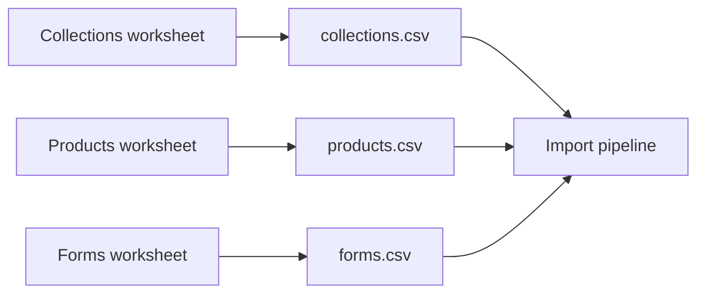
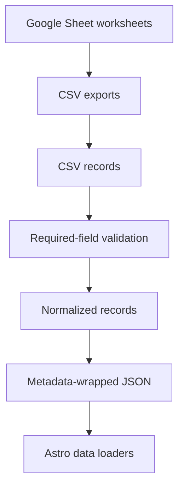

# Google Sheet Schema

## Table Of Contents

- [Purpose](#purpose)
- [Worksheets](#worksheets)
- [Collections Worksheet](#collections-worksheet)
- [Products Worksheet](#products-worksheet)
- [Forms Worksheet](#forms-worksheet)
- [Mapping To JSON](#mapping-to-json)
- [Related Documentation](#related-documentation)

## Purpose

The Google Sheet is the business owner's source of truth. Version 1 uses manual CSV exports from the sheet. Do not connect the Google Sheets API yet; the current pipeline reads files from `data/import/`.

For pipeline internals, see [IMPORT_PIPELINE.md](./IMPORT_PIPELINE.md). For runtime data relationships, see [DATA_MODEL.md](./DATA_MODEL.md).

## Worksheets

The workbook should contain three worksheets:



Export each worksheet as CSV and place it in `data/import/` with the exact expected filename.

## Collections Worksheet

CSV filename: `collections.csv`

Required columns:

- `id`
- `businessArea`
- `name`

Columns:

| Column | Required | Example | Maps To | Notes |
| --- | --- | --- | --- | --- |
| `id` | Yes | `bakery-cakes` | `id` | Stable unique collection ID. |
| `businessArea` | Yes | `bakery` | `businessArea`, loader `category` | Use `bakery` or `sewing`. |
| `slug` | Optional but needed for routes | `cakes` | `slug` | URL segment. |
| `name` | Yes | `Cakes` | `name`, loader `title` | Human-readable name. |
| `subtitle` | Optional | `Made for celebrations.` | `subtitle` | Short headline support. |
| `shortDescription` | Optional | `Thoughtful celebration cakes...` | `shortDescription` | Cards and summaries. |
| `description` | Optional | `Celebration cakes should feel...` | `description` | Detail page copy. |
| `imageFolder` | Optional | `bakery/cakes` | `imageFolder` | Future image organization. |
| `heroImage` | Optional | `/images/cakes/hero.jpg` | `heroImage` | Empty becomes `null`. |
| `featured` | Optional | `true` | `featured` | Accepts true-like values. |
| `status` | Optional | `Active` | `status`, loader `active` | `Active` renders publicly. |
| `displayOrder` | Optional | `3` | `displayOrder` | Numeric sort value. |
| `imageTone` | Optional | `cream` | `imageTone` | Placeholder tone. |
| `galleryCaptions` | Optional | `["A soft finish"]` | `galleryCaptions`, loader `galleryImages` | Must be valid JSON array. |
| `popularIdeas` | Optional | `["Birthday cake"]` | `popularIdeas` | Must be valid JSON array. |
| `customizationNote` | Optional | `Share your date...` | `customizationNote` | Inquiry guidance. |

Example row:

```csv
id,businessArea,slug,name,subtitle,shortDescription,description,imageFolder,heroImage,featured,status,displayOrder,imageTone,galleryCaptions,popularIdeas,customizationNote
bakery-cakes,bakery,cakes,Cakes,Made for celebrations.,Thoughtful celebration cakes with beautiful unfussy finishes.,Celebration cakes should feel special.,bakery/cakes,,true,Active,3,cream,"[""A soft simple finish""]","[""Birthday cake""]",Share your date and serving size.
```

## Products Worksheet

CSV filename: `products.csv`

Required columns:

- `id`
- `businessArea`
- `collection`
- `name`
- `formId`

Columns:

| Column | Required | Example | Maps To | Notes |
| --- | --- | --- | --- | --- |
| `id` | Yes | `bakery-cakes-birthday-cake` | `id` | Stable unique product ID. |
| `businessArea` | Yes | `bakery` | `businessArea` | Use `bakery` or `sewing`. |
| `collection` | Yes | `bakery-cakes` | `collection`, loader `collectionId` | Must match a collection ID. |
| `category` | Optional | `cake` | `category` | Product type. |
| `slug` | Optional but needed for routes | `birthday-cake` | `slug` | URL segment. |
| `name` | Yes | `Birthday Cake` | `name`, loader `title` | Human-readable product name. |
| `subtitle` | Optional | `Classic layers made to celebrate.` | `subtitle` | Detail page support. |
| `shortDescription` | Optional | `Customizable layer cake...` | `shortDescription` | Card copy. |
| `description` | Optional | `Our signature birthday cake...` | `description` | Detail copy. |
| `status` | Optional | `Active` | `status` | Loader maps to runtime status. |
| `featured` | Optional | `true` | `featured` | Featured display flag. |
| `imageFolder` | Optional | `bakery/cakes/birthday-cake` | `imageFolder` | Future image organization. |
| `formId` | Yes | `birthday-cake-form` | `formId` | Must match a form ID. |
| `image` | Optional | `/images/birthday-cake.jpg` | `image` | Empty becomes `null`. |
| `imageTone` | Optional | `cream` | `imageTone` | Placeholder tone. |
| `active` | Optional | `true` | `active` | Controls public listing. |
| `displayOrder` | Optional | `1` | `displayOrder` | Numeric sort value. |
| `priceLabel` | Optional | `From $45` | `priceLabel` | Display-only pricing. |

Example row:

```csv
id,businessArea,collection,category,slug,name,subtitle,shortDescription,description,status,featured,imageFolder,formId,image,imageTone,active,displayOrder,priceLabel
bakery-cakes-birthday-cake,bakery,bakery-cakes,cake,birthday-cake,Birthday Cake,Classic layers made to celebrate.,Customizable layer cake.,Our signature birthday cake.,Active,true,bakery/cakes/birthday-cake,birthday-cake-form,,cream,true,1,From $45
```

## Forms Worksheet

CSV filename: `forms.csv`

Required columns:

- `id`
- `name`

Columns:

| Column | Required | Example | Maps To | Notes |
| --- | --- | --- | --- | --- |
| `id` | Yes | `birthday-cake-form` | `id` | Stable form ID referenced by products. |
| `name` | Yes | `Birthday Cake` | `name`, loader `title` | Human-readable name. |
| `description` | Optional | `Customize a birthday cake order.` | `description` | Form summary. |
| `fields` | Optional but needed for dynamic forms | `[{...}]` | `fields` | Must be valid JSON array. |

Example row:

```csv
id,name,description,fields
birthday-cake-form,Birthday Cake,Customize a birthday cake order.,"[{""id"":""flavor"",""label"":""Flavor"",""type"":""select"",""required"":true,""options"":[{""value"":""vanilla"",""label"":""Vanilla""}]}]"
```

## Mapping To JSON



Mapping decisions:

- Empty image fields become `null`.
- Boolean fields are normalized from true-like values.
- Numeric fields are converted to numbers.
- JSON columns such as `fields`, `galleryCaptions`, and `popularIdeas` are parsed.
- Records are sorted by `id` before JSON generation.
- Generated metadata is added by the pipeline, not the sheet.

## Related Documentation

- [DATA_MODEL.md](./DATA_MODEL.md): property meanings and relationships
- [IMPORT_PIPELINE.md](./IMPORT_PIPELINE.md): validation, normalization, generation, and logging
- [ARCHITECTURE.md](./ARCHITECTURE.md): complete system architecture
- [DEVELOPER_GUIDE.md](./DEVELOPER_GUIDE.md): common editing workflows
