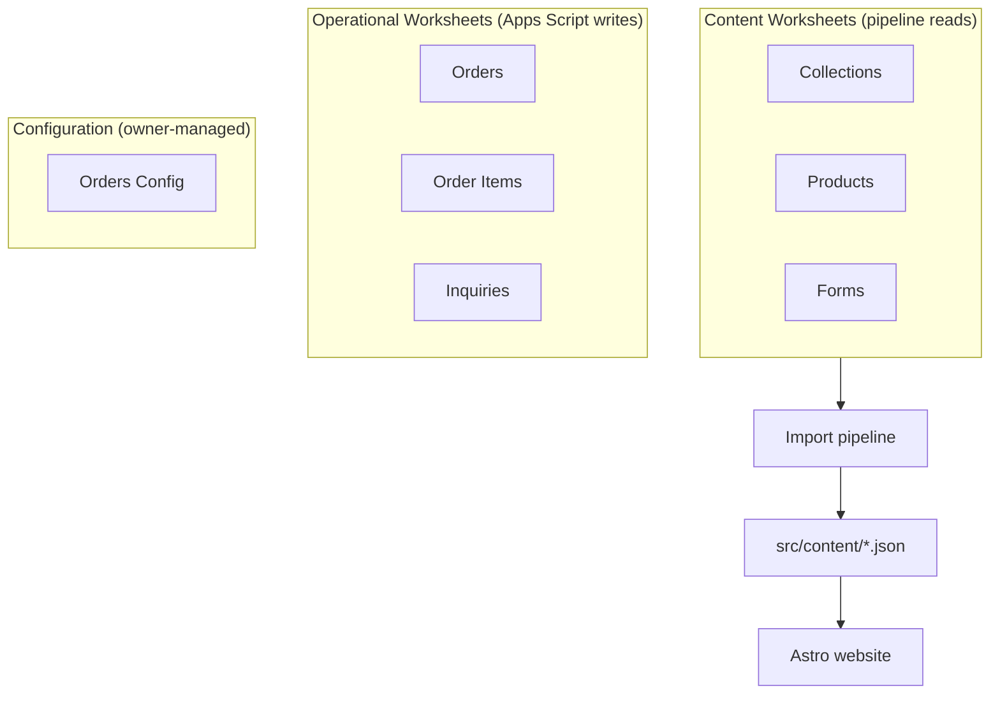
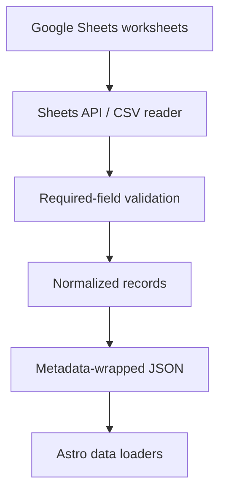

# Google Sheet Schema

## Table Of Contents

- [Purpose](#purpose)
- [Worksheets](#worksheets)
- [Collections Worksheet](#collections-worksheet)
- [Products Worksheet](#products-worksheet)
- [Forms Worksheet](#forms-worksheet)
- [Inquiries Worksheet](#inquiries-worksheet)
- [Orders Config Worksheet](#orders-config-worksheet)
- [Mapping To JSON](#mapping-to-json)
- [Related Documentation](#related-documentation)

## Purpose

The Google Sheet is the business owner's source of truth for product, collection, and form data. The pipeline reads worksheets directly via the Google Sheets API in production. CSV files in `data/import/` are supported as a local development fallback only.

For pipeline internals, see [IMPORT_PIPELINE.md](./IMPORT_PIPELINE.md). For runtime data relationships, see [DATA_MODEL.md](./DATA_MODEL.md).

## Worksheets

The workbook is organized into content worksheets (read by the pipeline) and operational worksheets (written by the Apps Script backend):


```mermaid
flowchart TD
  subgraph content["Content Worksheets (pipeline reads)"]
    collections["Collections"]
    products["Products"]
    forms["Forms"]
  end
  subgraph operational["Operational Worksheets (Apps Script writes)"]
    orders["Orders"]
    orderItems["Order Items"]
    inquiries["Inquiries"]
  end
  subgraph config["Configuration (owner-managed)"]
    ordersConfig["Orders Config"]
  end

  content --> pipeline["Import pipeline"]
  pipeline --> json["src/content/*.json"]
  json --> website["Astro website"]
```

In production (GitHub Actions), the pipeline reads worksheets directly using `SHEETS_ENABLED=true`. For local development, export each worksheet as CSV to `data/import/` with the expected filename (e.g. `products.csv`, `collections.csv`, `forms.csv`).

## Collections Worksheet

**Sheet tab name:** `Collections`

Required columns:

- `id`
- `businessArea`
- `name`

Columns:

| Column | Required | Example | Maps To | Notes |
| --- | --- | --- | --- | --- |
| `id` / `Collection ID` | Yes | `bakery-cakes` | `id` | Stable unique collection ID. |
| `businessArea` / `Business Area` | Yes | `bakery` | `businessArea`, loader `category` | Use `bakery` or `sewing`. |
| `slug` | Optional but needed for routes | `cakes` | `slug` | URL segment. |
| `name` / `Collection Name` | Yes | `Cakes` | `name`, loader `title` | Human-readable name. |
| `subtitle` | Optional | `Made for celebrations.` | `subtitle` | Short headline support. |
| `shortDescription` | Optional | `Thoughtful celebration cakes...` | `shortDescription` | Cards and summaries. |
| `description` | Optional | `Celebration cakes should feel...` | `description` | Detail page copy. |
| `imageFolder` | Optional | `bakery/cakes` | `imageFolder` | Image organization hint. |
| `heroImage` | Optional | `/images/cakes/hero.jpg` | `heroImage` | Empty becomes `null`. |
| `featured` | Optional | `true` | `featured` | Accepts true-like values. |
| `status` | Optional | `Active` | `status`, loader `active` | `Active` renders publicly. |
| `displayOrder` | Optional | `3` | `displayOrder` | Numeric sort value. |
| `imageTone` | Optional | `cream` | `imageTone` | Placeholder tone. |
| `galleryCaptions` | Optional | `["A soft finish"]` | `galleryCaptions`, loader `galleryImages` | Must be valid JSON array. |
| `popularIdeas` | Optional | `["Birthday cake"]` | `popularIdeas` | Must be valid JSON array. |
| `customizationNote` | Optional | `Share your date...` | `customizationNote` | Inquiry guidance. |

Example row:

```csv
id,businessArea,slug,name,subtitle,shortDescription,description,imageFolder,heroImage,featured,status,displayOrder,imageTone,galleryCaptions,popularIdeas,customizationNote
bakery-cakes,bakery,cakes,Cakes,Made for celebrations.,Thoughtful celebration cakes with beautiful unfussy finishes.,Celebration cakes should feel special.,bakery/cakes,,true,Active,3,cream,"[""A soft simple finish""]","[""Birthday cake""]",Share your date and serving size.
```

## Products Worksheet

**Sheet tab name:** `Products`

Required columns:

- `id`
- `businessArea`
- `collection`
- `name`

Columns:

| Column | Required | Example | Maps To | Notes |
| --- | --- | --- | --- | --- |
| `id` / `Product ID` | Yes | `bakery-cakes-birthday-cake` | `id` | Stable unique product ID. |
| `businessArea` / `Business Area` | Yes | `bakery` | `businessArea` | Use `bakery` or `sewing`. |
| `collection` / `Collection` | Yes | `bakery-cakes` | `collection`, loader `collectionId` | Must match a collection ID. |
| `category` | Optional | `cake` | `category` | Product type. |
| `slug` | Optional but needed for routes | `birthday-cake` | `slug` | URL segment. |
| `name` / `Product Name` | Yes | `Birthday Cake` | `name`, loader `title` | Human-readable product name. |
| `subtitle` | Optional | `Classic layers made to celebrate.` | `subtitle` | Detail page support. |
| `shortDescription` / `Short Description` | Optional | `Customizable layer cake...` | `shortDescription` | Card copy. |
| `description` | Optional | `Our signature birthday cake...` | `description` | Detail copy. |
| `price` | Optional | `45` | `price` | Numeric price. Empty or missing displays the product as Coming Soon. `0` is valid and purchasable. |
| `priceLabel` | Optional | `From $45` | `priceLabel` | Display-only pricing text. |
| `status` | Optional | `Active` | `status` | Loader maps to runtime status. |
| `active` | Optional | `true` | `active` | Controls public listing. |
| `featured` | Optional | `true` | `featured` | Controls highlighting in featured sections. Does not affect homepage. |
| `homepageFeatured` / `Homepage Featured` | Optional | `true` | `homepageFeatured` | Controls spotlight placement on the homepage. Independent of `featured`. |
| `galleryFeatured` / `Gallery Featured` | Optional | `true` | `galleryFeatured` | Controls whether the product appears in the gallery page. Defaults to `true`. Set `FALSE` to exclude from gallery. |
| `formId` / `Form ID` | Optional | `birthday-cake-form` | `formId` | Must match a form ID. Products without a form can still be ordered (no customization form is rendered). |
| `imageFolder` | Optional | `bakery/cakes/birthday-cake` | `imageFolder` | Image organization hint (overridden by image resolver). |
| `imageTone` | Optional | `cream` | `imageTone` | Placeholder tone. |
| `displayOrder` | Optional | `1` | `displayOrder` | Numeric sort value. |

Example row:

```csv
id,businessArea,collection,category,slug,name,subtitle,shortDescription,description,price,priceLabel,status,active,featured,homepageFeatured,galleryFeatured,formId,imageTone,displayOrder
bakery-cakes-birthday-cake,bakery,bakery-cakes,cake,birthday-cake,Birthday Cake,Classic layers made to celebrate.,Customizable layer cake.,Our signature birthday cake.,45,From $45,Active,true,true,true,true,birthday-cake-form,cream,1
```

## Forms Worksheet

**Sheet tab name:** `Forms`

Forms use a **row-per-field** format. Each row defines one field belonging to a form.

Required columns:

- `formId` (or `Form ID`)
- `fieldName` (or `Field Name`)

Columns:

| Column | Required | Example | Maps To | Notes |
| --- | --- | --- | --- | --- |
| `formId` / `Form ID` | Yes | `birthday-cake-form` | `id` (form-level) | Groups rows into a single form definition. |
| `formName` / `Form Name` | Yes (first row per form) | `Birthday Cake` | `name` (form-level) | Display name for the form. |
| `fieldName` / `Field Name` | Yes | `Flavor` | `label` (field-level) | Display label for the field. |
| `fieldType` / `Field Type` | Optional | `dropdown` | `type` (field-level) | Input type. `dropdown` maps to `select`. |
| `values` / `Values` | For choice fields | `Vanilla\|Chocolate\|Lemon` | `options` (field-level) | Pipe-delimited list of option values. |
| `required` / `Required` | Optional | `Yes` | `required` (field-level) | Whether the field is required. |

All rows with the same `formId` are grouped into one form record with an ordered `fields` array.

Example rows:

```csv
formId,formName,fieldName,fieldType,values,required
birthday-cake-form,Birthday Cake,Flavor,dropDown,Vanilla|Chocolate|Lemon|Marble,Yes
birthday-cake-form,Birthday Cake,Frosting,dropDown,Buttercream|Cream Cheese|Chocolate Ganache,Yes
birthday-cake-form,Birthday Cake,Custom Message,text,,No
```

## Inquiries Worksheet

**Sheet name:** `Inquiries`

This sheet is written by the Apps Script `handleInquiry()` function when a contact form is submitted.

Columns:

| Column | Type | Required | Description |
| --- | --- | --- | --- |
| `inquiryId` | string | yes | Auto-generated: `INQ-YYYYMMDD-###` |
| `createdAt` | string | yes | ISO timestamp of submission |
| `status` | string | yes | Initial value: `New` |
| `name` | string | yes | Customer full name |
| `email` | string | yes | Customer email address |
| `phone` | string | no | Customer phone number |
| `topic` | string | yes | Inquiry topic from form dropdown |
| `preferredContact` | string | yes | email / phone / text |
| `message` | string | yes | Freeform inquiry message |
| `source` | string | yes | Always `ripple-website` |

Example row:

| inquiryId | createdAt | status | name | email | phone | topic | preferredContact | message | source |
|---|---|---|---|---|---|---|---|---|---|
| INQ-20260727-001 | 2026-07-27T10:15:00Z | New | Eyal Tal | eyal@example.com | 555-0100 | custom | email | I'd like a custom quilted table runner. | ripple-website |

## Orders Config Worksheet

**Sheet tab name:** `Orders Config`

This sheet is the owner-facing configuration source for order workflows and business automation.

### Purpose

The Orders Config sheet stores key-value configuration pairs that control order processing and business automation behavior. It replaces hard-coded environment variables for settings that the owner needs to change without developer involvement.

### Format

| Key | Value | Description |
| --- | --- | --- |
| `notificationEmail` | `owner@ripplebakesandmakes.com` | Email address for order and inquiry notifications |
| `doctorEmailTo` | `owner@ripplebakesandmakes.com` | Recipient for automated health reports |
| `doctorEmailFrom` | `doctor@ripplebakesandmakes.com` | Sender address for health reports |
| `doctorEmailEnabled` | `true` | Enables or disables automated email delivery |

Additional rows can be added as the business grows.

### Related References

- The name `Orders Config` is defined in `scripts/pipeline/constants.ts` as the canonical sheet tab name.
- The Doctor reads these values when sending health report emails (see `AGENTS.md` → Doctor → Email Automation).
- The Apps Script backend (`processOrder()`) reads `notificationEmail` for order notifications.

## Mapping To JSON


```mermaid
flowchart TD
  sheets["Google Sheets worksheets"] --> reader["Sheets API / CSV reader"]
  reader --> validate["Required-field validation"]
  validate --> normalize["Normalized records"]
  normalize --> output["Metadata-wrapped JSON"]
  output --> loaders["Astro data loaders"]
```

Mapping decisions:

- Empty image fields become `null`.
- Boolean fields are normalized from true-like values.
- Numeric fields including `price` are converted to numbers.
- JSON columns such as `galleryCaptions` and `popularIdeas` are parsed.
- Row-per-field form rows are grouped by `formId` into a single form record with an ordered `fields` array.
- Records are sorted by `id` before JSON generation.
- Generated metadata is added by the pipeline, not the sheet.
- Product images are resolved dynamically by the image scanner, not from sheet columns.

## Related Documentation

- [DATA_MODEL.md](./DATA_MODEL.md): property meanings and relationships
- [IMPORT_PIPELINE.md](./IMPORT_PIPELINE.md): validation, normalization, generation, and logging
- [ARCHITECTURE.md](./ARCHITECTURE.md): complete system architecture
- [BUSINESS_WORKFLOW.md](./BUSINESS_WORKFLOW.md): owner guide for managing content
